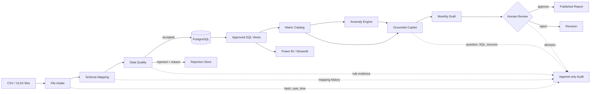

# InsightOps Copilot

**Auditable analytics automation, data quality and assisted reporting for Asteria Services.**

InsightOps Copilot receives monthly CSV/XLSX files from Finance, Procurement, Sales and Operations, maps changing source schemas to one canonical contract, rejects unsafe records, refreshes governed KPI, detects explainable anomalies and prepares a report draft that still requires human approval.

This is not a generic chatbot. The center of the product is the data contract, business rules, traceability and security. It runs fully without an external AI API through a deterministic rules-and-templates engine.

## Executed demo

The committed sample was generated with seed `20260717` and processed by the project code:

| Evidence | Result |
|---|---:|
| Historical coverage | 24 months |
| Source files | 97 |
| Ingestion runs | 97 |
| Rows received | 9,243 |
| Rows accepted | 9,048 |
| Rows rejected | 100 |
| Exact duplicate files skipped | 1 |
| Mean quality score | 99.86 / 100 |
| Governed KPI observations | 240 |
| Explainable anomaly signals | 66 |
| Copilot evaluation | 100% after final controls |
| Report state | Draft — human approval required |

The latest sample period intentionally contains a sales drop and other deviations. Source files also contain schema variants, missing values, negative amounts, future dates, duplicate business keys and one exact duplicate file.

## Architecture



The operational contract is `run_id → source file → mapping → rules → accepted/rejected records → metric definition → metric result → anomaly → report decision`.

## Repository map

```text
api/                 FastAPI endpoints and Pydantic validation
app/                 Six-page Streamlit operating console
config/              Project and security configuration
data/demo/           Reproducible sources, marts and manifest
database/            Database operating notes
docs/                Architecture, quality, security and AI governance
evaluations/         Grounded-answer test questions
powerbi/             DAX measures and connection guide
prompts/             Provider-independent grounding contract
reports/             Generated evaluation and report artifacts
scripts/             Pipeline, evaluation and test entrypoints
sql/                 PostgreSQL schema, indexes, roles and approved views
src/insightops/      Product modules
tests/               Automated functional and security tests
```

## End-to-end flow

1. **File Intake** validates type and size, detects CSV encoding/separator or workbook sheets, calculates SHA-256 and skips exact duplicates.
2. **Schema Mapping** normalizes names, matches aliases and similarity, stores confidence and routes uncertain mappings to human review.
3. **Data Quality** evaluates completeness, validity, uniqueness, consistency and timeliness; rejected rows keep rules and reasons.
4. **ETL** writes accepted records, refreshes marts and records processing evidence.
5. **Metric Catalog** defines every KPI before it can be used by the dashboard or Copilot.
6. **Anomaly Detection** combines robust z-score, moving median, month-over-month, budget and catalog-range rules.
7. **Copilot** answers only from approved views, shows read-only SQL, sources, period and metric IDs, and separates facts from hypotheses.
8. **Report Review** creates a draft. The state machine prevents publication before a named human approves it.

## KPI catalog

The included catalog governs sales, gross margin, expenses, orders, invoices, payments, suppliers, inventory, cycle time and compliance. Each definition includes formula, source view, owner, frequency, expected range, improvement direction and effective date. See [docs/metrics.md](docs/metrics.md).

## Data quality

Critical failures are rejected before metrics are calculated. Warnings such as IQR outliers remain visible for review. The quality score is weighted across:

- completeness 25%
- validity 25%
- uniqueness 20%
- consistency 15%
- timeliness 15%

Accepted and rejected rows are mutually exclusive, and all rejection reasons are retained. See [docs/data-quality.md](docs/data-quality.md).

## Anomalies

Signals are explainable and never presented as causal proof. Every row includes observed and expected values, variation, method, severity, source and review status. Isolation Forest is an optional extension for larger samples; the default executed pipeline uses transparent statistical and rule-based methods.

## Copilot safety

- allowlisted analytical views only
- `SELECT`/`WITH` only; all write and DDL operations blocked
- row limit and production timeout contract
- read-only database role
- untrusted file content separated from instructions
- prompt injection pattern detection
- catalogued metric citations, source and period required
- no access to raw sensitive tables
- no operational actions
- all interactions audited
- deterministic fallback when `LLM_PROVIDER=disabled`

An optional LLM provider can implement the `LLMProvider` protocol, but it receives only curated context. API keys stay in environment variables. Adding a provider does not relax SQL, source or approval controls.

## AI evaluation

The offline suite evaluates numerical grounding, source fidelity, coverage, period usage, insufficient-data behavior, unsupported claims and SQL safety:

```bash
python -m insightops.evaluation --data-dir data/demo/marts --output reports/copilot_evaluation.json
```

## Run locally

Requires Python 3.12.

```bash
python -m venv .venv
source .venv/bin/activate              # Windows: .venv\Scripts\activate
pip install -e .[dev]
python -m insightops.pipeline --output data/demo
python -m insightops.evaluation
pytest
```

Start the two user surfaces:

```bash
uvicorn api.main:app --reload           # API + Swagger at /docs
streamlit run app/streamlit_app.py      # Operating console
```

Or start PostgreSQL, API and Streamlit together:

```bash
docker compose up --build
```

The pipeline always produces a local SQLite reference database for a zero-infrastructure demonstration. PostgreSQL is the production design and is initialized from `sql/` by Docker Compose.

## FastAPI endpoints

`POST /files`, `GET /runs`, `GET /quality`, `GET /metrics`, `GET /anomalies`, `POST /copilot/questions`, `GET /reports/current` and `POST /reports/{id}/decision`. Interactive documentation is generated automatically at `/docs`.

## Power BI

The repository includes approved SQL views, a calendar/model recommendation, DAX and refresh guidance in `powerbi/`. It does **not** claim that a PBIX file exists.

## Testing

Sixteen tests cover file hash and duplicates, separator/encoding, schema mapping, quality rejections and score, governed metrics, explainable anomalies, dangerous SQL, view allowlisting, prompt injection, audit evidence, insufficient-data behavior, report transitions and offline Copilot evaluation. GitHub Actions repeats the pipeline, tests and evaluation on each push.

## Limitations and AI risks

- The demo uses synthetic data and is not a production benchmark.
- The deterministic Copilot supports a bounded set of business intents; it chooses honesty over broad but ungrounded answers.
- Attribution of a KPI change still requires business validation.
- Production file storage, secrets, identity and retention policies must follow the employer's security standards.
- Statistical anomaly thresholds require calibration to real data volume and seasonality.
- No report can become final without a recorded human decision.

## Future improvements

SSO/RBAC, object storage quarantine, encrypted PII tokenization, a mapping-review UI, scheduled orchestration, data contracts per source, drift baselines, provider-specific LLM adapters and production observability.

## License

MIT. The company and data are fictitious.

